<p align="center">
  
</p>

<p align="center">
  <strong>SOC Analyst · Threat Hunter · Offensive Security Practitioner</strong><br />
  <sub>Building practical security tooling, labs, and education through Zephryx.</sub>
</p>

<p align="center">
  <a href="https://zephryx.in">Website</a>
  ·
  <a href="https://www.youtube.com/@Zephryx_Academy">YouTube</a>
  ·
  <a href="https://www.linkedin.com/in/zephryx/">LinkedIn</a>
  ·
  <a href="https://x.com/zephryx01">X</a>
  ·
  <a href="mailto:contact@zephryx.in">Contact</a>
  ·
  <a href="mailto:security@zephryx.in">Security</a>
</p>

---

```console
mihir@zephryx:~$ whoami
Mihir — SOC Analyst, Threat Hunter, and offensive security practitioner.

mihir@zephryx:~$ mission
Turn complex cybersecurity concepts into practical labs, tools, and repeatable workflows.
```

## `> operational_focus`

- Threat hunting, SIEM investigation, alert triage, and network traffic analysis
- Web reconnaissance, service enumeration, Linux, and offensive-security labs
- Python and Selenium automation for repetitive SOC and reporting workflows
- DGA analysis, suspicious-domain investigation, and security research
- Practical cybersecurity education through **Zephryx Academy**

## `> currently_building`

- **Zephryx Platform** — a terminal-first cybersecurity platform for research, labs, and education
- **SOC Automation Lab** — scripts that reduce repetitive analyst work and improve reporting consistency
- **Web Enumeration Playbook** — practical workflows that begin with an exposed service and end with validated findings
- **Linux 100** — beginner-to-practical Linux learning material for cybersecurity students

## `> field_kit`

| Security operations | Offensive and network | Engineering |
|---|---|---|
| SIEM investigation, threat hunting, DGA analysis, incident triage | Nmap, web enumeration, network analysis, Linux, Bash | Python, Selenium, Git, TypeScript, Next.js, Tailwind CSS |

## `> operating_principles`

```text
01. Understand the system before touching the exploit.
02. Automate repetitive work, not analyst judgment.
03. Document findings so another person can reproduce them.
04. Test only in labs, authorized programs, or systems with explicit permission.
05. Share practical knowledge without fake promises or shortcuts.
```

## `> contribution_signal`

<picture>
  <source
    media="(prefers-color-scheme: dark)"
    srcset="https://raw.githubusercontent.com/zephryx01/zephryx01/output/github-contribution-grid-snake-dark.svg"
  />
  <source
    media="(prefers-color-scheme: light)"
    srcset="https://raw.githubusercontent.com/zephryx01/zephryx01/output/github-contribution-grid-snake.svg"
  />
  
</picture>

---

<p align="center">
  <sub>
    Security research and offensive-security content shown here is limited to authorized environments,
    labs, CTFs, and responsible disclosure programs.
  </sub>
</p>
